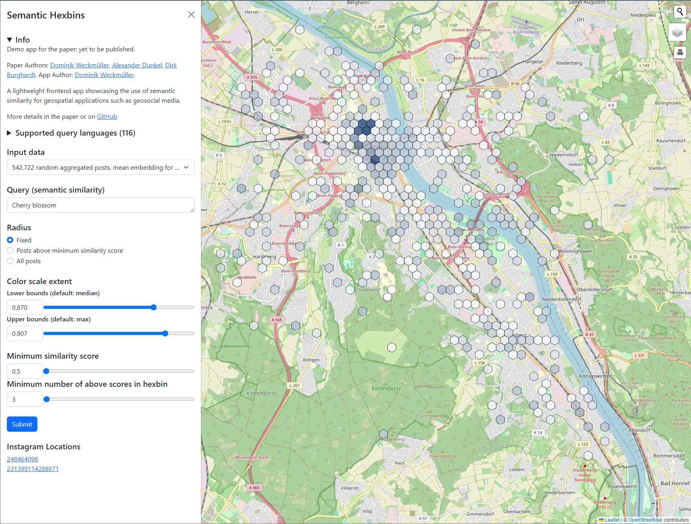

# Semantic Hexbins

A light-weight demo app for geospatial semantic search. Designed for georeferenced social media data.
Building on previous research:

- [An Application-Oriented Implementation of Hexagonal On-the-fly Binning Metrics for City-Scale Georeferenced Social Media Data](https://isprs-archives.copernicus.org/articles/XLVIII-4-W7-2023/253/2023/)
- [Developing a Privacy-Aware Map-Based Cross-Platform Social Media Dashboard for Municipal Decision-Making](https://isprs-archives.copernicus.org/articles/XLVIII-4-W1-2022/545/2022/)

Repository for the paper: XXX (still to submit)

## Idea 

The paper describes an approach to use semantic similarity for geospatial purposes, like georeferenced social media data.

## Data samples

- [10.000 random individual posts (10Mb)](data/10_000_rows_e5_multilingual_small__4_dec.json.gz)
- [20.000 random individual posts (20Mb)](data/20_000_rows_e5_multilingual_small__4_dec.json.gz)
- [40.000 random individual posts (40Mb)](data/40_000_rows_e5_multilingual_small__4_dec.json.gz)
- [693.959 random aggregated posts, mean embedding for 6630 locations (13Mb)](data/6630_rows_e5_multilingual_small_mean_location.json.gz)
- [693.293 random aggregated posts, mean embedding for 5964 locations with >1 posts (12Mb)](data/5964_rows_e5_multilingual_small_mean_location_greater_1.json.gz)
- [686.558 random aggregated posts, mean embedding for 4487 locations with >9 posts (9Mb)](data/4487_rows_e5_multilingual_small_mean_location_greater_9.json.gz)
- [542.722 random aggregated posts, mean embedding for 1028 locations with >99 posts (2Mb)](data/1028_rows_e5_multilingual_small_mean_location_greater_99.json.gz)

