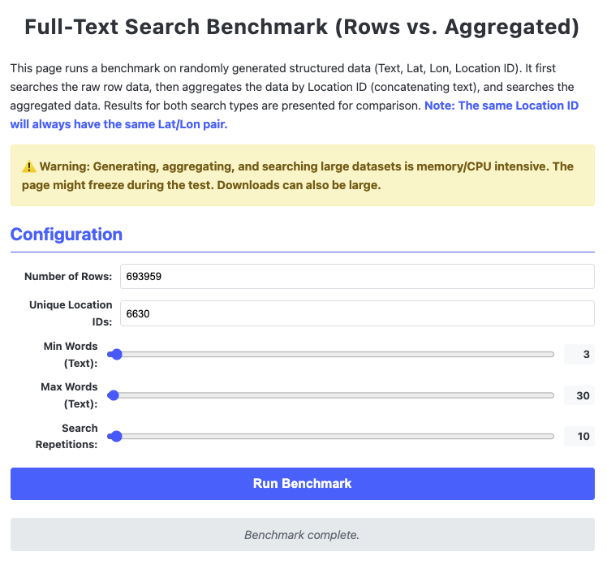
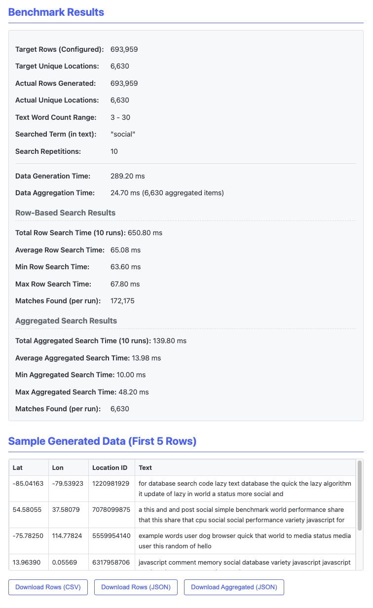

This is a simple benchmark for JS-based searching with structured data. The data is in the style of geo-social media data. 

The benchmark does not use any kind of index or other optimizations to be more coparable to semantic search. The standalone browser-based app can be opened in any browser and on any device. It looks like this: 

